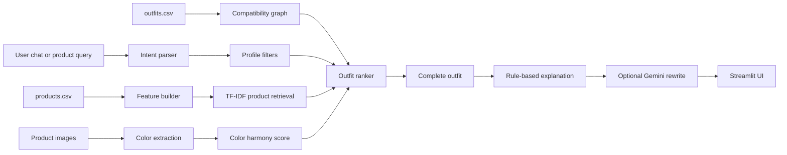

# Dare XAI Fashion Outfit Recommendation System

Beginner-friendly working prototype for the Dare XAI Machine Learning and AI Engineer Intern assignment.

The system recommends complete outfits from product metadata, product images, curated outfit mappings, user profile details, and natural language chat requests.

## What This Project Does

- Analyzes the provided fashion dataset of 68 products and 25 curated outfits.
- Builds a hybrid recommendation engine using TF-IDF retrieval, compatibility graph scoring, metadata filters, and simple image color extraction.
- Supports user-aware recommendations using gender, age, occasion, style, and budget.
- Provides a Streamlit chat interface for natural language outfit requests.
- Explains why the outfit items work together.
- Includes optional Gemini explanation rewriting when an API key is available.

## Quick Start

```bash
python -m pip install -r requirements.txt
streamlit run app.py
```

Then open the local URL printed by Streamlit.

## Optional Gemini Setup

The project works without Gemini. To use Gemini for more natural explanations:

```bash
set GOOGLE_API_KEY=your_key_here
streamlit run app.py
```

PowerShell users can also run:

```powershell
$env:GOOGLE_API_KEY="your_key_here"
streamlit run app.py
```

## Project Structure

```text
ML-TASK-main/
├── app.py                              # Streamlit prototype
├── products.csv                        # Product metadata
├── outfits.csv                         # Curated outfit combinations
├── images/                             # Product images
├── requirements.txt
├── src/fashion_assistant/
│   ├── data_loader.py                  # Loads CSVs and prepares features
│   ├── features.py                     # Role mapping and image color features
│   ├── intent.py                       # Simple natural language parser
│   ├── llm.py                          # Optional Gemini integration
│   └── recommender.py                  # Hybrid recommendation engine
├── scripts/
│   ├── analyze_dataset.py              # Prints dataset statistics
│   └── run_examples.py                 # CLI demo requests
├── docs/
│   ├── ARCHITECTURE.md
│   ├── DATASET_ANALYSIS.md
│   ├── TECHNICAL_DOCUMENTATION.md
│   └── DEMO_VIDEO_SCRIPT.md
└── tests/
    └── test_recommender.py
```

## Architecture Diagram



## ML and Recommendation Approach

The engine is hybrid:

1. **Text retrieval:** Product metadata is converted into TF-IDF vectors. User messages are matched against these vectors.
2. **Compatibility graph:** Items that appear together in curated outfits get stronger compatibility scores.
3. **Role completion:** The engine fills topwear, bottomwear, footwear, layers, and accessories based on product category.
4. **Image feature:** Product images are used to estimate a broad dominant color when text metadata does not already contain a color.
5. **Ranking:** Final scores combine text relevance, user profile fit, curated compatibility, color harmony, and rating.

## Example Requests

- "I need an outfit for a business meeting."
- "Suggest a smart casual outfit for a dinner date."
- "I am attending a wedding next weekend."
- "I am a 22-year-old male looking for a casual summer outfit."
- "Style something around a white formal shirt."

## Run Checks

```bash
python scripts/analyze_dataset.py
python scripts/run_examples.py
pytest
```

## Submission Notes

For the assignment submission:

1. Create a private GitHub repository.
2. Push this project.
3. Grant access to GitHub username `addygeek`.
4. Record a 5-10 minute demo using the outline in `docs/DEMO_VIDEO_SCRIPT.md`.
5. Upload the video as unlisted YouTube or accessible Google Drive link.
6. Submit the repository and video link in the assignment form.

## Known Limitations

- The dataset is small, so recommendations are explainable but not production accurate.
- Color extraction is intentionally simple and can be affected by image backgrounds.
- The chat parser is rule-based for clarity; a production system could replace it with an LLM intent classifier.
- The compatibility graph learns only from 25 curated outfits.
