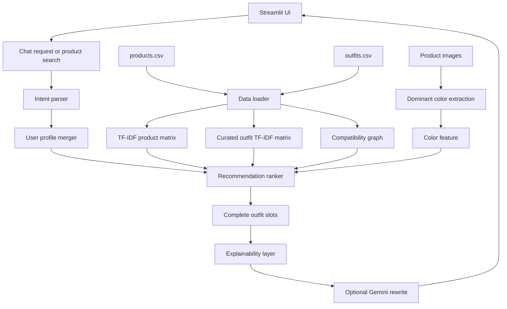

# Architecture

## High-Level Diagram

## Components

### 1. Data Layer

Files:

- `products.csv`
- `outfits.csv`
- `images/`

Code:

- `src/fashion_assistant/data_loader.py`
- `src/fashion_assistant/features.py`

The loader adds:

- `role`: topwear, bottomwear, footwear, accessory, layer, or main.
- `search_text`: combined product metadata used for TF-IDF.
- `image_path`: absolute image path for the UI.
- `color`: broad color feature from metadata or image pixels.

### 2. Intent Layer

File:

- `src/fashion_assistant/intent.py`

It detects:

- gender
- age
- occasion
- style
- wear type
- budget

This keeps the prototype understandable without depending fully on prompt engineering.

### 3. Recommendation Layer

File:

- `src/fashion_assistant/recommender.py`

The score combines:

- TF-IDF text similarity
- exact and nearby occasion match
- gender and wear type match
- curated outfit compatibility graph strength
- color harmony
- product rating
- budget penalty

### 4. Explainability Layer

The default explanation is rule-based and always available. Gemini can optionally rewrite it if an API key is set.

File:

- `src/fashion_assistant/llm.py`

### 5. Interface Layer

File:

- `app.py`

The app has:

- Chat Assistant
- Compatibility Engine
- Dataset Analysis
